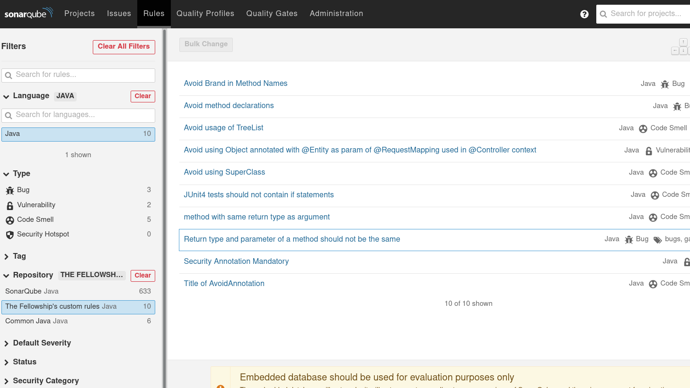
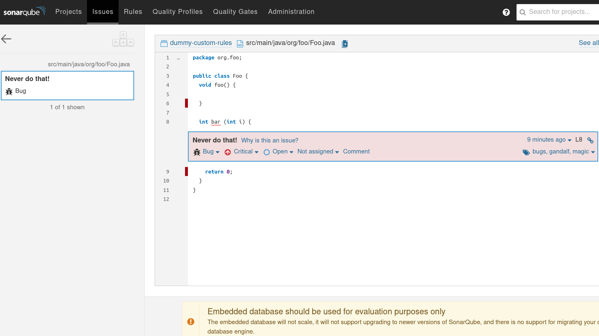

Writing Custom Java Rules 101
==========

You are using SonarQube and its Java Analyzer to analyze your projects, but there aren't rules that allow you to target some of your company's specific needs? Then your logical choice may be to implement your own set of custom Java rules.

This document is an introduction to custom rule writing for the SonarQube Java Analyzer. It will cover all the main concepts of static analysis required to understand and develop effective rules, relying on the API provided by the SonarQube Java Plugin.

## Content

* [Getting Started](#getting-started)
  * [Looking at the pom](#looking-at-the-pom)
* [Writing a rule](#writing-a-rule)
  * [Three files to forge a rule](#three-files-to-forge-a-rule)
  * [A specification to make it right](#a-specification-to-make-it-right)
  * [A test file to rule them all](#a-test-file-to-rule-them-all)
  * [A test class to make it pass](#a-test-class-to-make-it-pass)
  * [First version: Using syntax trees and API basics](#first-version-using-syntax-trees-and-api-basics)
  * [Second version: Using semantic API](#second-version-using-semantic-api)
  * [What you can use, and what you can't](#what-you-can-use-and-what-you-cant)
* [Registering the rule in the custom plugin](#registering-the-rule-in-the-custom-plugin)
  * [Rule Metadata](#rule-metadata)
  * [Rule Activation](#rule-activation)
  * [Rule Registrar](#rule-registrar)
* [Testing a custom plugin](#testing-a-custom-plugin)
  * [How to define rule parameters](#how-to-define-rule-parameters)
  * [How to test sources requiring external binaries](#how-to-test-sources-requiring-external-binaries)
  * [How to test precise issue location](#how-to-test-precise-issue-location)
  * [How to test the Source Version in a rule](#how-to-test-the-source-version-in-a-rule)
* [References](#references)

## Getting started

The rules you are going to develop will be delivered using a dedicated, custom plugin, relying on the **SonarQube Java Plugin API**. In order to start working efficiently, we provide a empty template maven project, that you will fill in while following this tutorial.

Grab the template project from there and import it to your IDE: https://github.com/SonarSource/sonar-custom-rules-examples/tree/master/java-custom-rules

This project already contains custom rules. Our goal will be to add an extra rule!

### Looking at the POM

A custom plugin is a Maven project, and before diving into code, it is important to notice a few relevant lines related to the configuration of your soon-to-be-released custom plugin.

In the code snippet below, note the plugin API version (`<sonar.version>`) provided through the properties. It relates to the minimum version of SonarQube your plugin will support, and is generally aligned to your company's SonarQube instance. In this template, we rely on the version **7.7** (LTS version is **6.7**, but compatibility to latest release is guaranteed when packaging the plugin).
Note that latest released versions of the Java Analyzer are always compatible with the current LTS version of SonarQube.

The property `<java.plugin.version>` is the minimum version of the Java Analyzer that will be required to run your custom plugin in your SonarQube instance. Consequently, as we will rely on version **5.12.1.17771** of the Java plugin, the SonarQube instance which will use the custom plugin will also need version **5.12.1.17771** of the Java Plugin as well.

For the moment, don't touch these two properties.

Other properties such as `<groupId>`, `<artifactId>`, `<version>`, `<name>` and `<description>` can be freely modified.

```xml
<groupId>org.sonar.samples</groupId>
<artifactId>java-custom-rules</artifactId>
<version>1.0-SNAPSHOT</version>
<packaging>sonar-plugin</packaging>
 
<properties>
  <sonar.version>7.7</sonar.version>
  <java.plugin.version>5.12.1.17771</java.plugin.version>
</properties>
<name>Java Custom Rules - Template</name>
```

In the code snippet below, it is important to note that the **entry point of the plugin** is provided as the `<pluginClass>` in the configuration of the sonar-packaging-maven plugin, using the fully qualified name of the java class `MyJavaRulesPlugin`.
If you refactor your code, rename, or move the class extending `org.sonar.api.SonarPlugin`, you will have to change this configuration.
It's also the property `<sonarQubeMinVersion>` which guarantees the compatibility with LTS 6.7.

```xml
<plugin>
  <groupId>org.sonarsource.sonar-packaging-maven-plugin</groupId>
  <artifactId>sonar-packaging-maven-plugin</artifactId>
  <version>1.17</version>
  <extensions>true</extensions>
  <configuration>
    <pluginKey>java-custom</pluginKey>
    <pluginName>Java Custom Rules</pluginName>
    <pluginClass>org.sonar.samples.java.MyJavaRulesPlugin</pluginClass>
    <sonarLintSupported>true</sonarLintSupported>
    <sonarQubeMinVersion>6.7</sonarQubeMinVersion> <!-- allows to depend on API 7.x but still run on LTS 6.7 -->
  </configuration>
</plugin>
```

## Writing a rule

In this section we will write a custom rule from scratch. To do so, we will use a [Test Driven Development](https://en.wikipedia.org/wiki/Test-driven_development) (TDD) approach, relying on writing some test cases first, followed by the implementation a solution.

### Three files to forge a rule

When implementing a rule, there is always a minimum of 3 distinct files to create:
  1. A test file, which contains Java code used as input data for testing the rule
  1. A test class, which contains the rule's unit test
  1. A rule class, which contains the implementation of the rule.
  
To create our first custom rule (usually called a "*check*"), let's start by creating these 3 files in the template project, as described below:

  1. In folder `/src/test/files`, create a new empty file named `MyFirstCustomCheck.java`, and copy-paste the content of the following code snippet.
```java
class MyClass {
}
```

  2. In package `org.sonar.samples.java.checks` of `/src/test/java`, create a new test class called `MyFirstCustomCheckTest` and copy-paste the content of the following code snippet.
```java
package org.sonar.samples.java.checks;
 
import org.junit.Test;
 
public class MyFirstCustomCheckTest {
 
  @Test
  public void test() {
  }
 
}
```

  3. In package org.sonar.samples.java.checks of `/src/main/java`, create a new class called `MyFirstCustomCheck` extending class `org.sonar.plugins.java.api.IssuableSubscriptionVisitor` provided by the Java Plugin API. Then, replace the content of the `nodesToVisit()` method with the content from the following code snippet. This file will be described when dealing with implementation of the rule!
```java
package org.sonar.samples.java.checks;
 
import org.sonar.plugins.java.api.IssuableSubscriptionVisitor;
import org.sonar.plugins.java.api.tree.Tree.Kind;
import java.util.Collections;
import java.util.List;
 
@Rule(key = "MyFirstCustomRule")
public class MyFirstCustomCheck extends IssuableSubscriptionVisitor {
 
  @Override
  public List<Kind> nodesToVisit() {
    return Collections.emptyList();
  }
 
}

```

>
> :question: **More files...**
> 
> If the 3 files described above are always the base of rule writing, there are situations where extra files may be needed. For instance, when a rule uses parameters, or if its behavior relies on the detected version of java, multiple test files could be required. It is also possible to use external files to describe rule metadata, such as a description in html format. Such situations will be described in other topics of this documentation.
>

### A specification to make it right

Of course, before going any further, we need a key element in rule writhing, a specification! For the sake of the exercise, lets consider the following quote from a famous Guru as being the specification of our custom rule, as it is of course absolutely correct and incontrovertible.

>
> **Gandalf - Why Program When Magic Rulez (WPWMR, p.42)**
>
> *“For a method having a single parameter, the types of its return value and its parameter should never be the same.”*
>

### A test file to rule them all

Because we chose a TDD approach, the first thing to do is to write examples of the code our rule will target. In this file, we consider numerous cases that our rule may encounter during an analysis, and flag the lines which will require our implementation to raise issues. The flag to be used is a simple `// Noncompliant` trailing comment on the line of code where an issue should be raised. Why *Noncompliant*? Because the flagged lines do not *comply* with the rule.

Covering all the possible cases is not necessarily required, the goal of this file is to cover all the situations which may be encountered during an analysis, but also to abstract irrelevant details. For instance, in the context of our first rule, the name of method, the content of its body, and the owner of the method make no difference, whether it's an abstract class, a concrete class, or an interface. Note that this sample file does not need to be compilable, but it should be structurally correct.

In the test file `MyFirstCustomCheck.java` created earlier, copy-paste the following code: 
```java
class MyClass {
  MyClass(MyClass mc) { }
  
  int     foo1() { return 0; }
  void    foo2(int value) { }
  int     foo3(int value) { return 0; } // Noncompliant
  Object  foo4(int value) { return null; }
  MyClass foo5(MyClass value) {return null; } // Noncompliant
  
  int     foo6(int value, String name) { return 0; }
  int     foo7(int ... values) { return 0;}
}
```

The test file now contains the following test cases:
* line 2: A constructor, to differentiate the case from a method;
* line 4: A method without parameter (`foo1`);
* line 5: A method returning void (`foo2`);
* line 6: A method returning the same type as its parameter (`foo3`), which will be noncompliant;
* line 7: A method with a single parameter, but a different return type (`foo4`);
* line 8: Another method with a single parameter and same return type, but with non-primitive types (`foo5`), therefore non compliant too;
* line 10: A method with more than 1 parameter (`foo6`);
* line 11: A method with a variable arity argument (`foo7`);

### A test class to make it pass

Once the test file is updated, let's update our test class to use it, and link the test to our (not yet implemented) rule. To do so, get back to our test class `MyFirstCustomCheckTest`, and update the `test()` method as shown in the following code snippet (you may have to import class `org.sonar.java.checks.verifier.JavaCheckVerifier`):

```java
  @Test
  public void test() {
    JavaCheckVerifier.verify("src/test/files/MyFirstCustomCheck.java", new MyFirstCustomCheck());
  }
```

As you probably noticed, this test class contains a single test, the purpose of which is to verify the behavior of the rule we are going to implement. To do so, it relies on usage of the `JavaCheckVerifier` class, provided by the Java Plugin rule testing API. This `JavaCheckVerifier` class provides useful methods to validate rule implementations, allowing us to totally abstract all the mechanisms related to analyzer initialization. Note that while verifying a rule, the *verifier* will collect lines marked as being *Noncompliant*, and verify that the rule raises the expected issues and *only* those issues.

Now, let's proceed to the next step of TDD: make the test fail!

To do so, simply execute the test from the test file using JUnit. The test should **fail** with error message "**At least one issue expected**", as shown in the code snippet below. Since our check is not yet implemented, no issue can be raised yet, so that's the expected behavior.

```
java.lang.IllegalStateException: At least one issue expected
    at com.google.common.base.Preconditions.checkState(Preconditions.java:145)
    at org.sonar.java.checks.verifier.CheckVerifier.assertMultipleIssue(CheckVerifier.java:166)
    at org.sonar.java.checks.verifier.CheckVerifier.checkIssues(CheckVerifier.java:161)
    at org.sonar.java.checks.verifier.JavaCheckVerifier.scanFile(JavaCheckVerifier.java:237)
    at org.sonar.java.checks.verifier.JavaCheckVerifier.scanFile(JavaCheckVerifier.java:220)
    at org.sonar.java.checks.verifier.JavaCheckVerifier.scanFile(JavaCheckVerifier.java:216)
    at org.sonar.java.checks.verifier.JavaCheckVerifier.verify(JavaCheckVerifier.java:99)
    at org.sonar.template.java.checks.MyFirstCustomCheckTest.test(MyFirstCustomCheckTest.java:10)
    ...
```

### First version: Using syntax trees and API basics

Before we start with the implementation of the rule itself, you need a little background.

Prior to running any rule, the SonarQube Java Analyzer parses a given Java code file and produces an equivalent data structure: the **Syntax Tree**. Each construction of the Java language can be represented with a specific kind of Syntax Tree, detailing each of its particularities. Each of these constructions is associated with a specific Kind as well as an interface explicitly describing all its particularities. For instance, the kind associated to the declaration of a method will be `org.sonar.plugins.java.api.tree.Tree.Kind.METHOD`, and its interface defined by  `org.sonar.plugins.java.api.tree.MethodTree`. All the kinds are listed in the the [`Kind` enum of the Java Plugin](https://github.com/SonarSource/sonar-java/blob/5.12.1.17771/java-frontend/src/main/java/org/sonar/plugins/java/api/tree/Tree.java#L47).

When creating the rule class, we chose to implement the `IssuableSubscriptionVisitor` class from the API. This class, on top of providing a bunch of useful methods to raise issues, also **defines the strategy which will be used when analyzing a file**. As its name is telling us, it is based on a subscription mechanism, allowing to specify on what kind of tree the rule should react. The list of node types to cover is specified through the `nodesToVisit()` method. In the previous steps, we modified the implementation of the method to return an empty list, therefore not subscribing to any node of the syntax tree.

Now its finally time to jump in to the implementation of our first rule! Go back to the `MyFirstCustomCheck` class, and modify the list of Kinds returned by the nodesToVisit() method. Since our rule targets method declarations, we only need to visit methods. To do so, simply make sure that we return a singleton list containing only `Kind.METHOD` as a parameter of the returned list, as shown in the following code snippet.

```java
@Override
public List<Kind> nodesToVisit() {
  return Collections.singletonList(Kind.METHOD);
}
```

Once the nodes to visit are specified, we have to implement how the rule will react when encountering method declarations. To do so, override method `visitNode(Tree tree)`, inherited from `SubscriptionVisitor` through `IssuableSubscriptionVisitor`.

```java
@Override
public void visitNode(Tree tree) {
}
```

Because we registered the rule to visit Method nodes, we know that every time the method is called, the tree parameter will be a `org.sonar.plugins.java.api.tree.MethodTree` (the interface tree associated with the `METHOD` kind). As a first step, we can consequently safely cast the tree directly into a MethodTree, as shown below. Note that if we had registered multiple node types, we would have to test the node kind before casting by using the method `Tree.is(Kind ... kind)`.

```java
@Override
public void visitNode(Tree tree) {
  MethodTree method = (MethodTree) tree;
}
```

Now, let's narrow the focus of the rule by checking that the method has a single parameter, and raise an issue if it's the case.

```java
@Override
public void visitNode(Tree tree) {
  MethodTree method = (MethodTree) tree;
  if (method.parameters().size() == 1) {
    reportIssue(method.simpleName(), "Never do that!");
  }
}
```

The method `reportIssue(Tree tree, String message)` from `IssuableSubscriptionVisitor` allows to report an issue on a given tree with a specific message. In this case, we chose to report the issue at a precise location, which will be the name of the method.

Now, let's test our implementation by executing `MyFirstCustomCheckTest.test()` again.

```
java.lang.AssertionError: Unexpected at [5, 7, 11]
    at org.fest.assertions.Fail.failure(Fail.java:228)
    at org.fest.assertions.Fail.fail(Fail.java:218)
    at org.sonar.java.checks.verifier.CheckVerifier.assertMultipleIssue(CheckVerifier.java:175)
    at org.sonar.java.checks.verifier.CheckVerifier.checkIssues(CheckVerifier.java:161)
    at org.sonar.java.checks.verifier.JavaCheckVerifier.scanFile(JavaCheckVerifier.java:237)
    at org.sonar.java.checks.verifier.JavaCheckVerifier.scanFile(JavaCheckVerifier.java:220)
    at org.sonar.java.checks.verifier.JavaCheckVerifier.scanFile(JavaCheckVerifier.java:216)
    at org.sonar.java.checks.verifier.JavaCheckVerifier.verify(JavaCheckVerifier.java:99)
    at org.sonar.template.java.checks.MyFirstCustomCheckTest.test(MyFirstCustomCheckTest.java:10)
    ...
```

Of course, our test failed again... The `JavaCheckVerifier` reported that lines 5, 7 and 11 are raising unexpected issues, as visible in the stack-trace above. By looking back at our test file, it's easy to figure out that raising an issue line 5 is wrong because the return type of the method is void, line 7 is wrong because `Object` is not the same as int, and line 11 is also wrong because of the variable arity of the method. Raising these issues is however correct accordingly to our implementation, as we didn't check for the types of the parameter and return type. To handle type, however, we will need to rely on more that what we can achieve using only knowledge of the syntax tree. This time, we will need to use the semantic API!

>
> :question: **IssuableSubscriptionVisitor and BaseTreeVisitor**
>
> For the implementation of this rule, we chose to use an `IssuableSubscriptionVisitor` as the implementation basis of our rule. This visitor offers an easy approach to writing quick and simple rules, because it allows us to narrow the focus of our rule to a given set of Kinds to visit by subscribing to them. However, this approach is not always the most optimal one. In such a situation, it could be useful to take a look at another visitor provided with the API: `org.sonar.plugins.java.api.tree.BaseTreeVisitor`. The `BaseTreeVisitor` contains a `visit()` method dedicated for each and every kind of the syntax tree, and is particularly useful when the visit of a file has to be fine tuned.
>
> In [rules already implemented in the Java Plugin](https://github.com/SonarSource/sonar-java/tree/5.12.1.17771/java-checks/src/main/java/org/sonar/java/checks), you will be able to find multiple rule using both approaches: An `IssuableSubscriptionVisitor` as entry point, helped by simple `BaseTreeVisitor`(s) to identify pattern in other parts of code.
>

### Second version: Using semantic API

Up to now, our rule implementation only relied on the data provided directly by syntax tree that resulted from the parsing of the code. However, the SonarAnalyzer for Java provides a lot more regarding the code being analyzed, because it also construct a ***semantic model*** of the code. This semantic model provides information related to each ***symbol*** being manipulated. For a method, for instance, the semantic API will provide useful data such as a method's owner, its usages, the types of its parameters and its return type, the exception it may throw, etc. Don't hesitate to explore the [semantic package of the API](https://github.com/SonarSource/sonar-java/tree/5.12.1.17771/java-frontend/src/main/java/org/sonar/plugins/java/api/semantic) in order to have an idea of what kind of information you will have access to during analysis!

But now, let's go back to our implementation and take advantage of the semantic.

Once we know that our method has a single parameter, let's start by getting the symbol of the method using the `symbol()` method from the `MethodTree`.

```java
@Override
public void visitNode(Tree tree) {
  MethodTree method = (MethodTree) tree;
  if (method.parameters().size() == 1) {
    MethodSymbol symbol = method.symbol();
    reportIssue(method.simpleName(), "Never do that!");
  }
}

```

From the symbol, it is then pretty easy to retrieve **the type of its first parameter**, as well as the **return type** (You may have to import `org.sonar.plugins.java.api.semantic.Symbol.MethodSymbol` and `org.sonar.plugins.java.api.semantic.Type`).

```java
@Override
public void visitNode(Tree tree) {
  MethodTree method = (MethodTree) tree;
  if (method.parameters().size() == 1) {
    MethodSymbol symbol = method.symbol();
    Type firstParameterType = symbol.parameterTypes().get(0);
    Type returnType = symbol.returnType().type();
    reportIssue(method.simpleName(), "Never do that!");
  }
}
```

Since the rule should only raise an issue when these two types are the same, we then simply test if the return type is the same as the type of the first parameter using method `is(String fullyQualifiedName)`, provided through the `Type` class, before raising the issue.

```java
@Override
public void visitNode(Tree tree) {
  MethodTree method = (MethodTree) tree;
  if (method.parameters().size() == 1) {
    MethodSymbol symbol = method.symbol();
    Type firstParameterType = symbol.parameterTypes().get(0);
    Type returnType = symbol.returnType().type();
    if (returnType.is(firstParameterType.fullyQualifiedName())) {
      reportIssue(method.simpleName(), "Never do that!");
    }
  }
}
```

Now, **execute the test** class again.

Test passed? If not, then check if you somehow missed a step.

If it passed...

>
> :tada: **Congratulations!** :confetti_ball:
>
> [*You implemented your first custom rule for the SonarQube Java Analyzer!*](resources/success.jpg)
>

### What you can use, and what you can't

When writing custom Java rules, you can only use classes from package [`org.sonar.plugins.java.api`](https://github.com/SonarSource/sonar-java/tree/5.12.1.17771/java-frontend/src/main/java/org/sonar/plugins/java/api).

When browsing the existing 500+ rules from the SonarJava plugin, you will sometime notice use of some other utility classes, not part of the API. While these classes could be sometime extremely useful in your context, **these classes are not available at runtime** for custom rule plugins. It means that, while your unit tests are still going to pass when building the plugin, your rules will most likely make analysis **crash at analysis time**.

Note that we are always open to discussion, so don't hesitate to reach us and participate to threads, through our [community forum](https://community.sonarsource.com/), to suggest features and API improvement!

## Registering the rule in the custom plugin

OK, you are probably quite happy at this point, as our first rule is running as expected... However, we are not really done yet. Before playing our rule against any real projects, we have to finalize its creation within the custom plugin, by registering it.

### Rule Metadata
The first thing to do is to provide to our rule all the metadata which will allow us to register it properly in the SonarQube platform. To do so, add the `org.sonar.check.Rule` annotation to `MyFirstCustomCheck` class rule, and provide a **key**, a **name**, a **description** and optional **tags**, as in the following code snippet.

```java
@Rule(
  key = "MyFirstCustomCheck",
  name = "Return type and parameter of a method should not be the same",
  description = "For a method having a single parameter, the types of its return value and its parameter should never be the same.",
  priority = Priority.CRITICAL,
  tags = {"bug"})
public class MyFirstCustomCheck extends IssuableSubscriptionVisitor {
  // ...
}
```

### Rule Activation
The second things to do is to activate the rule within the plugin. To do so, open class `RulesList` (`org.sonar.samples.java.RulesList`). In this class, you will notice methods `getJavaChecks()` and `getJavaTestChecks()`. These methods are used to register our rules with alongside the rule of the Java plugin. Note that rules registered in `getJavaChecks()` will only be played against source files, while rules registered in `getJavaTestChecks()` will only be played against test files. To register the rule, simply add the rule class to the list builder, as in the following code snippet:

```java
public static List<Class<? extends JavaCheck>> getJavaChecks() {
  return Collections.unmodifiableList(Arrays.asList(
      // other rules...
      MyFirstCustomCheck.class
    ));
}

```

### Rule Registrar

Because your rules are relying on the SonarJava API, you also need to tell the SonarJava parent plugin that some new rules have to be retrieved. If you are using the template custom plugin as a base of this tutorial, you should have everything done already, but feel free to have a look at the `MyJavaFileCheckRegistrar.java` class, which connects the dots. Finally, be sure that this registrar class is also correctly added as an extension for your custom plugin, by adding it to your Plugin definition class (`MyJavaRulesPlugin.java`).

```java
/**
 * Provide the "checks" (implementations of rules) classes that are going be executed during
 * source code analysis.
 *
 * This class is a batch extension by implementing the {@link org.sonar.plugins.java.api.CheckRegistrar} interface.
 */
@SonarLintSide
public class MyJavaFileCheckRegistrar implements CheckRegistrar {
 
  /**
   * Register the classes that will be used to instantiate checks during analysis.
   */
  @Override
  public void register(RegistrarContext registrarContext) {
    // Call to registerClassesForRepository to associate the classes with the correct repository key
    registrarContext.registerClassesForRepository(MyJavaRulesDefinition.REPOSITORY_KEY, checkClasses(), testCheckClasses());
  }
 
 
  /**
   * Lists all the main checks provided by the plugin
   */
  public static List<Class<? extends JavaCheck>> checkClasses() {
    return RulesList.getJavaChecks();
  }
 
  /**
   * Lists all the test checks provided by the plugin
   */
  public static List<Class<? extends JavaCheck>> testCheckClasses() {
    return RulesList.getJavaTestChecks();
  }
 
}
```

## Testing a custom plugin

>
> :exclamation: **Prerequisite**
> 
> For this chapter, you will need a local instance of SonarQube. If you don't have a SonarQube platform installed on your machine, now is time to download its latest version from [HERE](https://www.sonarqube.org/downloads/)!
>

At this point, we've completed the implementation of a first custom rule and registered it into the custom plugin. The last remaining step is to test it directly with the SonarQube platform and try to analyse a project! 

Start by building the project using maven:

```
$ pwd
/home/gandalf/workspace/java-custom-rules-template
  
$ mvn clean install
[INFO] Scanning for projects...
[INFO]                                                                        
[INFO] ------------------------------------------------------------------------
[INFO] Building Java Custom Rules - Template 1.0-SNAPSHOT
[INFO] ------------------------------------------------------------------------
  
...
 
[INFO] ------------------------------------------------------------------------
[INFO] BUILD SUCCESS
[INFO] ------------------------------------------------------------------------
[INFO] Total time: 4.102 s
[INFO] Finished at: 2016-05-23T16:21:55+02:00
[INFO] Final Memory: 25M/436M
[INFO] ------------------------------------------------------------------------
```

Then, grab the jar file `java-custom-rules-1.0-SNAPSHOT.jar` from the `target` folder of the project, and move it to the extensions folder of your SonarQube instance, which will be located at `$SONAR_HOME/extensions/plugins`.

>
> :exclamation: **SonarQube Java Plugin compatible version**
>
> Before going further, be sure to have the adequate version of the SonarQube Java Plugin with your SonarQube instance. The dependency over the Java Plugin of our custom plugin is defined in its `pom`, as seen in the first chapter of this tutorial.
>
> If you have a fresh install or do not possess the same version, install the adequate version of the Java Plugin. The latest version of the plugin can be downloaded from [HERE](https://docs.sonarqube.org/display/PLUG/SonarJava).
>

Now, (re-)start your SonarQube instance, log as admin and navigate to the ***Rules*** tab.

From there, under the language section, select "**Java**", and then "**MyCompany Custom Repository**" under the repository section. Your rule should now be visible (with all the other sample rules). 



Once activated, the only step remaining is to analyse one of your project!

When encountering a method returning the same type as its parameter, the issue will now raise issue, as visible in the following picture:



### How to define rule parameters

You have to add a `@RuleProperty` to your Rule.

Check this example: [SecurityAnnotationMandatoryRule.java](https://github.com/SonarSource/sonar-custom-rules-examples/blob/master/java-custom-rules/src/main/java/org/sonar/samples/java/checks/SecurityAnnotationMandatoryRule.java)

### How to test sources requiring external binaries

In the `pom.xml`, define in the `Maven Dependency Plugin` part all the JARs you need to run your Unit Tests. For example, if you sample code used in your Unit Tests is having a dependency on Spring, add it there.

See: [pom.xml#L147](https://github.com/SonarSource/sonar-custom-rules-examples/blob/master/java-custom-rules/pom.xml#L147)

### How to test precise issue location

You can raise an issue on a given line, but you can also raise it at a specific Token. Because of that, you may want to specify, in your sample code used by your Unit Tests, the exact location, i.e. in between which 2 specific Columns, where you are expecting the issue to be raised.

This can be achieved using the special keywords `sc` (start-column) and `ec` (end-column) in the `// Noncompliant` comment. In the following example, we are expecting to have the issue being raised between the column 27 and 32 (i.e. exactly on "Order" variable type):

```java
public String updateOrder(Order order) { // Noncompliant [[sc=27;ec=32]] {{Don't use Order here because it's an @Entity}}
```

### How to test the Source Version in a rule

Starting from **Java Plugin API 3.7** (Oct 2015), the java source version can be accessed directly when writing custom rules. This can be achieved by simply calling the method `getJavaVersion()` from the context. Note that the method will return null only when the property is not set. Similarily, it is possible to specify to the verifier a version of Java to be considered as runtime execution, calling method `verify(String filename, JavaFileScanner check, int javaVersion)`.

```java
@Beta
public interface JavaFileScannerContext {

  // ...
  
  @Nullable
  Integer getJavaVersion();
  
}
```

## References

* [SonarJava documentation](https://docs.sonarqube.org/display/PLUG/SonarJava)
* [SonarQube Platform](http://www.sonarqube.org/)
* [SonarQube Java Plugin Github repository](https://github.com/SonarSource/sonar-java)
* [SonarQube Java Custom Rules Example](https://github.com/SonarSource/sonar-custom-plugin-example)
You can explore a sample plugin containing some custom rules. This project can be [browsed](https://github.com/SonarSource/sonar-custom-rules-examples/tree/master/java-custom-rules) or [downloaded](https://github.com/SonarSource/sonar-custom-rules-examples/archive/master.zip).
